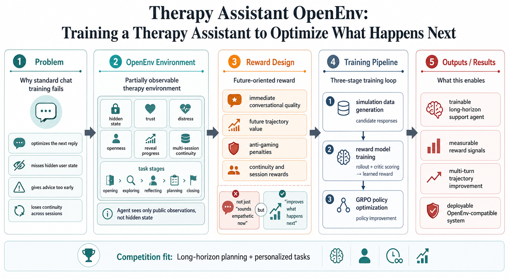
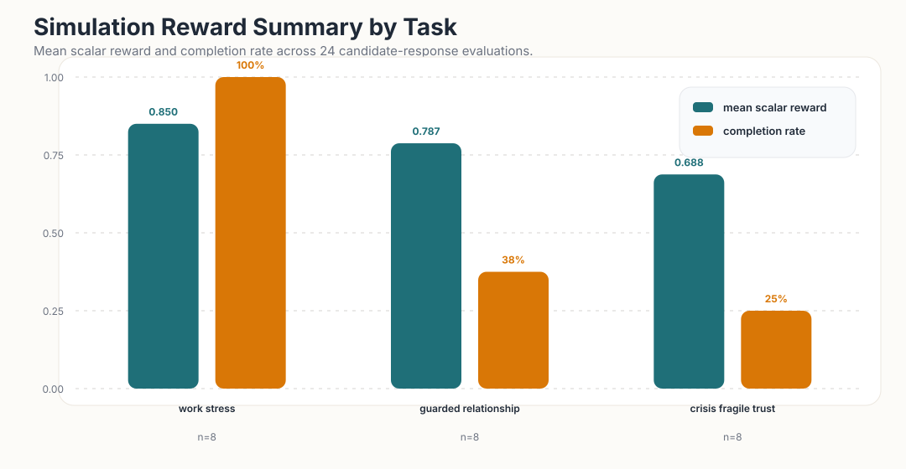
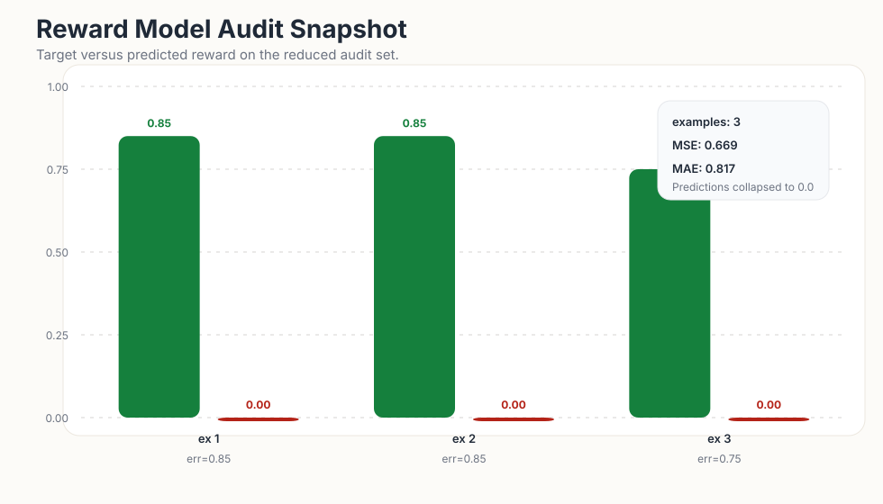
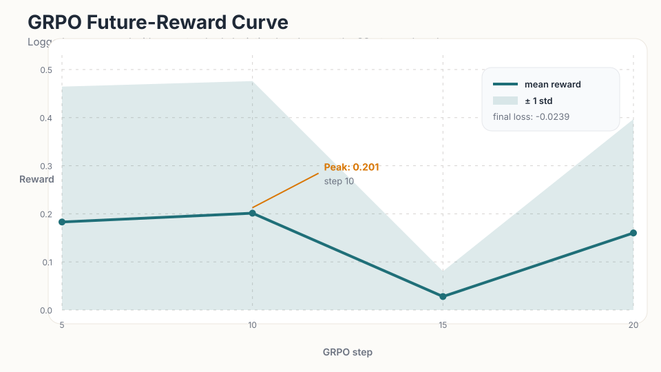

# Training a Therapy Assistant to Optimize What Happens Next

Most language models are optimized to produce a good answer for the current turn.

That is not enough for emotionally sensitive support.

In real support conversations, the best reply is often not the most impressive-sounding one. It is the one that makes the next few turns safer, more honest, and more productive. If the assistant gives advice too early, trust drops. If it misses the real issue under the surface complaint, the user never opens up. If it forgets what happened last session, the interaction stops feeling credible.

That is the gap we chose to target for the OpenEnv Hackathon.

We built an OpenEnv-compatible training environment for a long-horizon therapy-style assistant: a system that must infer hidden emotional state, build trust over time, carry continuity across sessions, and optimize future user outcomes rather than only locally polished responses.

This submission fits most strongly in:

- Theme #2: Long-Horizon Planning and Instruction Following
- Theme #3.2: Personalized Tasks

*Figure 1. High-level system diagram: the problem framing, OpenEnv environment, reward design, three-stage training loop, and intended outcomes.*

## The Problem

Emotional support is hard for LLMs because the real objective is delayed.

A strong conversation is not defined by one empathetic sentence. It is defined by whether the assistant helps the user move toward disclosure, stabilization, reflection, planning, and safe follow-through over time.

So instead of asking only:

- Was the reply empathetic?

we ask:

- Did it increase trust?
- Did it lower distress?
- Did it help the real issue surface?
- Did it preserve continuity across sessions?
- Did it improve the likely future trajectory of the conversation?

Those are long-horizon questions. They require hidden state, delayed reward, and task progression under partial observability. That is exactly why this is a good OpenEnv problem.

## What We Built

We built a turn-based, partially observable environment for therapy-style support conversations.

The agent only sees the public observation: the user’s latest message, a stage hint, the task ID, and rollout budget context. But the environment internally tracks the hidden emotional state that actually determines whether the interaction is getting better.

That hidden state includes:

- trust
- distress
- openness
- reveal progress
- conversation stage
- continuity and memory across sessions
- working goals and unfinished threads
- safety-sensitive progress

This means the model cannot directly read whether the user is ready to disclose or whether the conversation is close to rupture. It has to infer those things from the dialogue itself.

## The Environment Design

The environment is stateful, not a static prompt set.

Each task is a multi-session arc with progression logic, hard completion conditions, and room for both improvement and failure. The assistant has to pace the interaction correctly: listen early, earn disclosure, avoid premature solutioning, and eventually move toward a stable close.

We currently include three built-in therapy archetypes:

- `work_stress_venting`
- `guarded_relationship`
- `crisis_fragile_trust`

These were chosen to expose different behavioral demands:

- support without rushing into advice
- trust-building before the real issue is disclosed
- calm and safety-aware handling under fragile conditions

Success is intentionally hard-gated. A conversation only counts as successful if the model reaches the right final stage and also satisfies task-specific thresholds around trust, distress, disclosure, and safety handling.

## Why Hidden State Matters

Two responses can sound equally kind while producing very different futures.

One may increase openness and invite honest disclosure. Another may quietly push the user into shutdown. Surface text alone does not capture that difference, so our environment models it explicitly through hidden transitions.

That is the core design choice of the project:

we are not training the model to imitate a supportive tone.

We are training it to act on a latent emotional process that unfolds over time.

## Rewarding the Future, Not Just the Present

The reward function is designed around future trajectory quality, not only one-turn style.

It combines:

- immediate conversational quality
- future-oriented trajectory value
- anti-gaming penalties
- long-horizon continuity terms

Immediate quality captures whether the response fits the current stage, improves trust, lowers distress, and advances the interaction naturally.

Future-oriented reward captures the more important question: did this response put the conversation into a better next state than it was in before?

We also penalize strategically weak behaviors such as:

- dismissiveness
- premature advice
- bare or low-effort replies
- interrogation-style overload
- repetition

This makes the reward much more aligned with real support behavior than ordinary next-turn scoring.

## The Training Pipeline

We wanted this project to be more than an environment demo, so we built a full three-stage training loop on top of it.

### 1. Environment-backed simulation

We start from seed dialogue prefixes and ask a policy model to generate candidate therapist responses.

Each candidate is then rolled forward through the environment, and a separate critic scores the future trajectory quality. That gives us training records of the form:

- dialogue context
- candidate response
- future-oriented reward

This turns emotional support from a static supervised task into a trajectory-learning problem.

### 2. Learned future-oriented reward model

We then train a scalar reward model on the simulated candidate data.

This distills the future-trajectory judgment into a learned model that can be used cheaply during policy optimization. We also write audit summaries so we can inspect reward-model failures instead of treating the learned reward as a black box.

### 3. GRPO policy optimization

Finally, we optimize the policy with GRPO using the learned reward model.

That closes the loop:

- the environment defines the world
- simulation creates trajectory-level supervision
- the reward model distills that supervision
- GRPO improves the policy against that signal

This is the main claim of the project: not just a benchmark, but a trainable world for long-horizon personalized support.

## Results

We completed an end-to-end reduced run of the full pipeline and produced artifacts for all three stages.

These are preliminary fast-run results, not final large-scale training numbers. They are important because they demonstrate that the environment, reward modeling, and RL fine-tuning stack work together as one executable system.

### Stage 1: Simulation data generation

The simulation run produced:

- `24` candidate-reward examples in `results/candidate_rewards.jsonl`
- `3` rollout trajectory records in `results/trajectories.jsonl`

The generated examples show the intended behavior of the environment: candidate responses are judged not only by surface empathy, but by whether they improve the future trajectory of the conversation under hidden-state dynamics.

In the generated `work_stress_venting` trajectories, the system was able to move the dialogue toward disclosure of burnout, higher trust, and lower distress while preserving continuity into the next session. In harder crisis-style rollouts, the environment preserved the need for trust-building and safety-aware pacing instead of rewarding immediate overreach.

*Figure 2. Candidate-response simulation summary. The easiest task (`work_stress_venting`) scores highest, while harder tasks show lower reward and lower completion rate, which is the behavior we want from a difficulty-aware environment.*

### Stage 2: Reward model

For reward modeling, we trained a frozen-backbone regressor on top of:

- `meta-llama/Llama-3.2-1B-Instruct`

The reward-model artifacts were successfully generated, including metadata and audit summaries.

The current audit summary reports:

- `num_examples = 3`
- `MSE = 0.669`
- `MAE = 0.817`

The most important reading of this result is not that the reward model is already strong. It is that the reward-learning stage executed end to end and produced inspectable diagnostics. On this very small fast-run dataset, the reward model is clearly data-limited and undertrained, which is exactly what we would expect from such a reduced setting.

*Figure 3. Reward-model audit on the reduced evaluation set. The model currently collapses its predictions toward zero, which is a useful failure signal and a clear target for scaling the next run.*

### Stage 3: GRPO policy optimization

We successfully ran GRPO and produced policy-training artifacts, including trainer state and adapter outputs.

In the recorded training run:

- total GRPO steps: `20`
- peak logged reward mean: `0.201` at step `10`
- final logged reward mean: `0.160` at step `20`

This should be interpreted as proof that the learned reward can drive policy optimization in the environment-aligned pipeline. It is not yet a claim of final benchmark-quality improvement. The current run is deliberately small and infrastructure-focused, but it demonstrates that the full loop from simulation to reward model to policy update is operational.

*Figure 4. GRPO training curve over the reduced run. Even in a short 20-step setup, the pipeline produces a measurable reward signal and policy-learning dynamics.*

## What These Results Mean

The strongest result of this submission is system-level: we now have a working environment where long-horizon emotional support is trainable rather than only discussable.

The current artifacts already show:

- a stateful OpenEnv-compatible environment
- hidden-state progression across therapy-style tasks
- future-oriented candidate scoring
- a learned reward-model stage with audits
- GRPO-based policy optimization over that learned reward

That is the key milestone for this competition. We are not presenting a one-off prompt demo. We are presenting a training environment with an actual post-training path.

## Why This Is a Strong OpenEnv Submission

This project aligns with the competition in four important ways.

First, it is a real environment. It has hidden state, turn-by-turn transitions, reward, termination, and multi-session continuity.

Second, it targets a meaningful capability that current models still struggle with: pacing emotionally sensitive interaction under partial observability.

Third, the reward is not just a style score. It tries to capture whether the assistant improves the future of the interaction.

Fourth, the project includes a concrete training pipeline and real artifacts from that pipeline.

That combination is what makes the submission defensible: problem, environment, reward, and post-training loop all point in the same direction.

## What We Expect at Larger Scale

The reduced run establishes the full methodology. The next expectation is straightforward: scale the same pipeline with more simulation data, broader seed coverage, and longer GRPO runs.

At larger scale, we expect improvement on:

- when to listen instead of solving
- how to earn disclosure before pushing for action
- how to recover from early conversational mistakes
- how to maintain continuity across sessions
- how to handle safety-sensitive cases without rupturing trust

The important point is that the environment gives us a way to measure those behaviors as trajectories rather than anecdotes.

## Closing

This project is our attempt to move emotional-support training from "write a nicer reply" to "create a better next few sessions."

By combining hidden-state dialogue dynamics, future-oriented reward, multi-session trajectories, and a full training loop, we built an OpenEnv-compatible world where long-horizon personalized support becomes trainable.

That is the story of this submission:

we are not only teaching the model to sound supportive now.

We are teaching it to improve what happens next.
